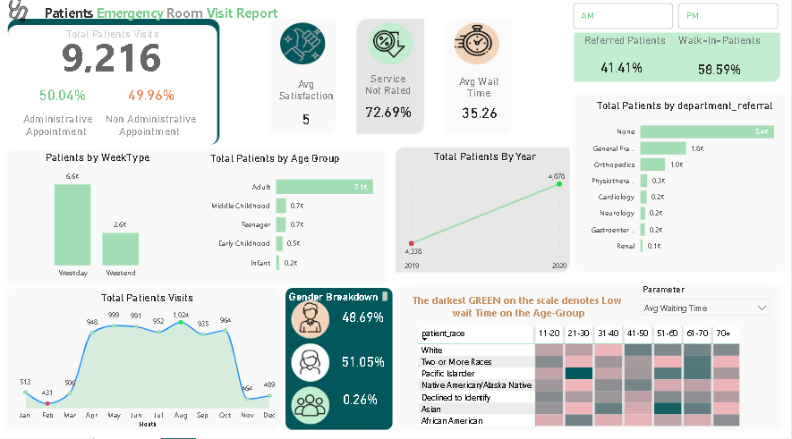

# 🏥 Patients Emergency Room Visit Dashboard & Executive Summary

This project provides a professional Power BI dashboard analyzing Emergency Room (ER) visits along with an in-depth executive summary. It is designed for healthcare data analysts, hospital administrators, and quality improvement teams to monitor and optimize ER performance and patient experience.

---

## 📊 Dashboard Overview

The dashboard visualizes:

- **Total ER visits** split by administrative vs. non-administrative appointments
- **Patient satisfaction** and **average wait time**
- **Visit patterns** by day, month, and year
- **Demographics:** gender, age group, and ethnicity
- **Referrals** by department
- **Equity-focused wait time heatmap** across race and age groups

Built with Power BI, it offers actionable insights on ER operations and performance.

---

## 📄 Executive Summary Highlights

### ✅ Total Patient Visits
- **9,216 visits** overall
- 50.04% administrative vs. 49.96% non-administrative

### ⏱️ Service Performance
- **Average Wait Time:** 35.26 minutes
- **Average Satisfaction Score:** 5
- **Unrated Services:** 72.69% (needs improvement in data collection)

### 🧑‍🤝‍🧑 Demographics
- Adults: 7.1K
- Gender: 51% Male, 49% Female, 0.26% Other

### 🩺 Department Referrals
- 5.4K patients resolved within ER
- Top referrals: General Practice & Orthopedics

### 📈 Yearly Trend
- Increase from 4,338 (2019) to 4,878 (2020)

### 📌 Recommendations
- Improve feedback collection
- Monitor seasonal demand
- Address equity in wait time
- Manage walk-in patient load

## 📷 Dashboard Snapshot

---

## 📝 License

This project is licensed under the **MIT License**. 

---

## 🤝 Contributing

Pull requests are welcome! If you have ideas to improve the dashboard or summary, please fork the repo and open a PR.

---

## 📬 Contact

For questions, feedback, or collaborations:  
**Mohamed Makrani**  
makrani.mohamed@ump.ac.ma

---

> Empowering healthcare teams with data to make faster, fairer decisions.
